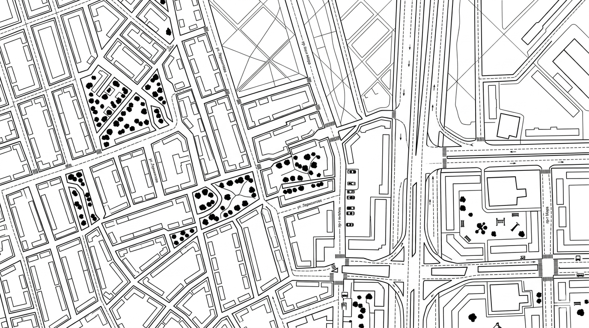

# IP Address Tracker

A small web app that resolves any IPv4 address (or its current visitor) to a
geographic location and renders it on an interactive map. Built as a Frontend
Mentor challenge solution and extended with a preloader and a light/dark theme.



## Features

- **IP lookup** via the [IPify Geolocation API](https://geo.ipify.org/) —
  country, region, city, timezone and ISP.
- **Interactive map** rendered with [Leaflet](https://leafletjs.com/) using
  [CARTO basemap tiles](https://carto.com/basemaps/), with a marker pinned at
  the resolved coordinates.
- **Light / dark theme toggle** in the bottom-right corner (bottom-center on
  mobile). The selection is persisted to `localStorage`; the first visit
  respects `prefers-color-scheme`. Map tiles, page background pattern and
  marker icon all swap in sync with the theme.
- **Preloader overlay** shown while initial tiles or a new lookup are still
  loading.
- **Responsive** layout, tested on mobile and desktop breakpoints.
- **Input validation** — the search bar only accepts a well-formed IPv4
  address.

## Tech stack

- Vanilla JavaScript (ES modules)
- [Leaflet](https://leafletjs.com/) 1.9 for the map
- [Parcel](https://v1.parceljs.org/) 1.x as the bundler / dev server
- CSS custom properties for theming

## Project structure

```
.
├── index.html              # Markup + theme toggle button
├── images/                 # Background patterns + marker icons
├── src/
│   ├── index.js            # Entry point — wires everything together
│   ├── style.css           # Theme variables, layout, components
│   └── helpers/
│       ├── add-tile-layer.js   # Builds Carto tile URLs per theme
│       ├── add-offset.js       # Pans the map on small screens
│       ├── get-address.js      # IPify API call
│       ├── marker-icon.js      # Theme-aware Leaflet icon
│       ├── theme.js            # Theme store (localStorage + subscribers)
│       ├── theme-toggle.js     # Binds the toggle button to the store
│       ├── validate-ip.js      # IPv4 regex check
│       └── index.js            # Barrel export
└── package.json
```

## Getting started

Requires Node.js (Parcel 1 works best on Node 14–18).

```bash
# install dependencies
npm install

# start the dev server at http://localhost:1234
npm start

# production build → ./build
npm run build
```

## Configuration

The IPify API key is currently hard-coded in
[`src/helpers/get-address.js`](src/helpers/get-address.js). Because the call
runs in the browser, the key inevitably ships to the client; to prevent abuse,
add a **domain allowlist** for your key in the IPify dashboard.

## Deployment

The project is set up for [Vercel](https://vercel.com/):

```bash
npm run deploy
```

This runs `npm run build` (via the `predeploy` script) and then
`vercel --prod`. Vercel should pick up the `build/` output directory; if it
does not, add a minimal `vercel.json`:

```json
{ "outputDirectory": "build" }
```

## Credits

- Challenge by [Frontend Mentor](https://www.frontendmentor.io/).
- Map tiles by [CARTO](https://carto.com/attributions) and
  [OpenStreetMap contributors](https://www.openstreetmap.org/copyright).
- Geolocation data by [IPify](https://geo.ipify.org/).
